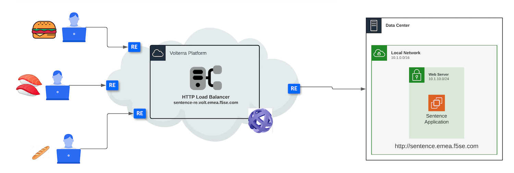

Lab 1 - Architecture of the lab
###############################

The application used in the lab
*******************************

For this lab, we will use this application : https://arcadia.emea.f5se.com

This application is a modern application simulating a banking application. You can buy and sell stocks, or make money transfer to friends.

|

The lab architecture
********************

As you can notice in the chart below, the Arcadia application is running in our own datacenter, and is already available on internet (https://arcadia.emea.f5se.com)
We will expose this application on the F5XC Global Network by configuring the following F5XC Console components:

* Origin Pool
* HTTP Load Balancer

.. warning:: All over the lab, please be careful and stay in your NameSpace. Every SE/Student has his/her own NameSpace.

Terminology
===========

**HTTP Load Balancer**
F5XC reverse proxy and HTTP load balancer concepts allow for flow control of application and API traffic between services, to the internet, and from clients on the internet. HTTP Load Balancers allow for steering decisions based on URI or other HTTP based criteria.

**Origin Pool**
An origin pool is a mechanism to configure a set of application endpoints grouped together into a resource pool. These endpoints could be IP:port tuples within a give site or a service discovered by one of Volterra’s many service discovery methods. These objects will be used the next step.

.. note:: The goal is to publish this application through the F5XC Global Network so people all over the world can reach the closest F5XC RE.

 