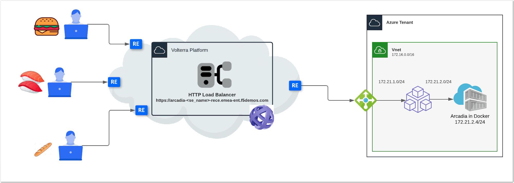

Module 2 - Use Case 2 - Expose a private application and protect it with F5XC WAAP
##################################################################################

In this section, we will expose the same application, but this time, the application is running in a private environment and it is not exposed on the Internet.
It means the DevOps pushed the app in a modern environment (k8s, AKS, EKS or just docker ...), and SecOps need to expose it on the internet thanks to F5XC and multi-cloud story.

The architecture is as below

|

As you may notice:

* Arcadia is running in a private docker instance (Ubuntu) in Azure
* Docker instance IP address is ``172.21.2.4``
* A MESH Node is already deployed, up and running, in order to do not wait 20 minutes
* This Node has 2 interfaces connected to ``external-subnet (172.21.1.0/24)`` and ``internal-subnet (172.21.2.0/24)``

|

**Module 2 - All sections**

.. toctree::
   :maxdepth: 1
   :glob:

   lab*/lab*

