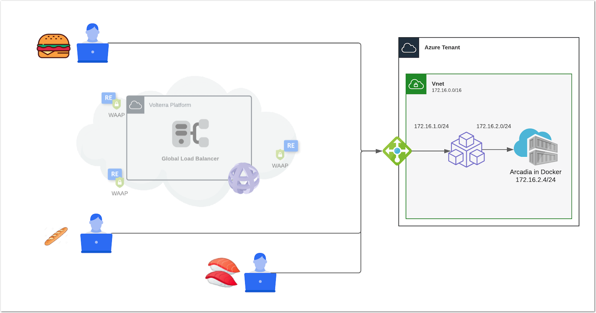

Module 3 - Use Case 3 - Protect an app running in Public Cloud only
###################################################################

In this section, the application is still running in Docker machine in Azure. But you don't want to transit through F5XC Global Network, many many reasons:

* Compliancy and regulation
* Latency in countries not covered by F5XC pops
* Any other reason

|

The architecture is as below. It is the same as previous lab, but users/consumers will bypass the F5XC Global Network, and connect directly to the Mesh Node in Azure (via Azure LB)

**Module 3 - All sections**

.. toctree::
   :maxdepth: 1
   :glob:

   lab*/lab*

