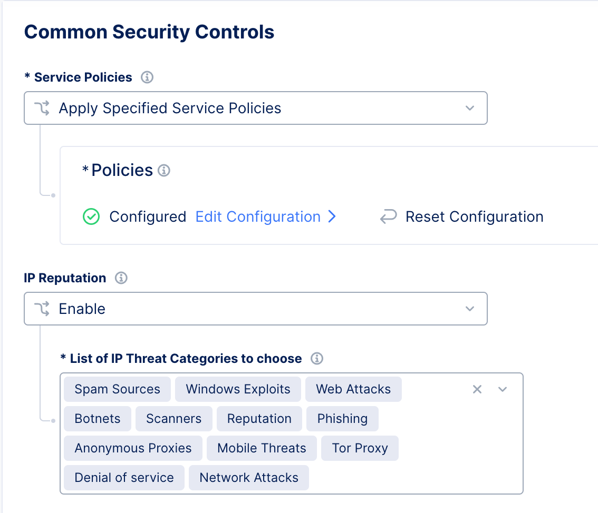

Lab 1 - Enable IP Reputation
############################

F5XC Distributed Cloud WAAP includes by default an external feed for IP Reputation.

.. note:: Positive Security is done via Service Policy. It is a another object/policy, separated from the WAAP policy

*  Check you are in your NameSpace
*  Create a new ``Service Policy`` and name it ``sp-positive-security``
*  Select ``Custom Rule List`` and create the first rule (item) for ``IP Reputation``
*  Name this rule ``ip-rep-deny``
*  Select the action ``Deny`` and in client selection choose ``List of IP Threat Categories``
*  Add all categories

Stay in your Service Policy and move to the next lab. We will create 3 more rules.

