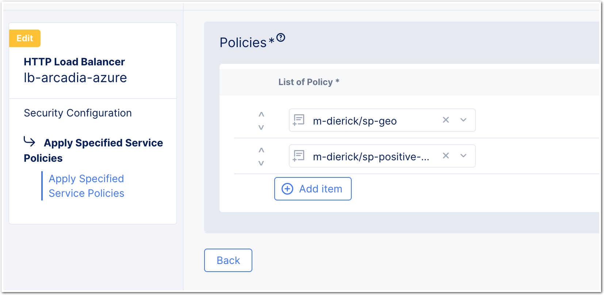

Lab 2 - Allow HTTP Methods, File Types and Geolocalisation
##########################################################

In this lab, we will create 3 more rules:

* Allow only GET and POST HTTP Methods
* Disallow some file types (exe, bat ...)
* Geoloc - disallow some countries

Disallow file types
*******************

* In the same Service Policy, create a new rule
* Name it as you want ``file-type-deny``
* In action, set ``Deny``
* In Request Match, and HTTP Path, click ``configure``
* Add this value in the ``Regex Values``

  .. code-block:: BASH

      (.doc|.docx|.pdf|.exe|.bat)$

.. note:: This will disallow doc, docx, pdf, exe and bat file types.

|

Geoloc - disallow countries
***************************

* For Geolocalization or any Source IP rules, a ``new Service Policy`` is required. This can't be added to the L7 Custom Policy
* Create a new Service Policy named ``sp-geo``
* In the rules, instead of creating a custom rule, we wil create a ``Denied Sources`` rule
* In ``Country List``, select the countries you want to deny
* Check default action is set to ``Next Policy``

  .. image:: ../pictures/lab2/geo.png
     :align: center
     :scale: 50%

|

Allow HTTP Methods
******************

* In the same Service Policy created in previous lab, create a new rule
* Name it as you want ``method-allow``
* In action, set ``Allow``
* In Request Match, Configure ``HTTP Method``
* Add ``GET`` and ``POST``
* Save your rule.
* You should see now 2 rules

  * IP-Reputation rule
  * Methods allowed rule

|

.. note:: You should have 3 rules in your Service Policy. Check the order.

  .. image:: ../pictures/lab2/all-rules.png
     :align: center

|

Assign your Service Policies to your HTTP LB
********************************************

* Now you can assign your 2 SP to your HTTP LB. The HTTP LB you prefer to make your test.
* Don't forget the order

  * First : SP Geoloc
  * Second : SP Positive Security

|

.. note:: Test your Service Policies :)

    