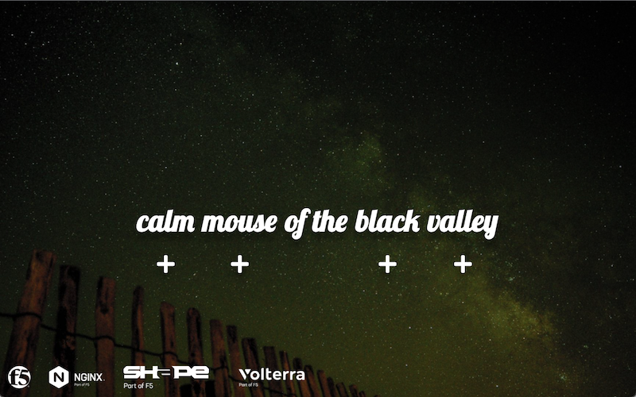
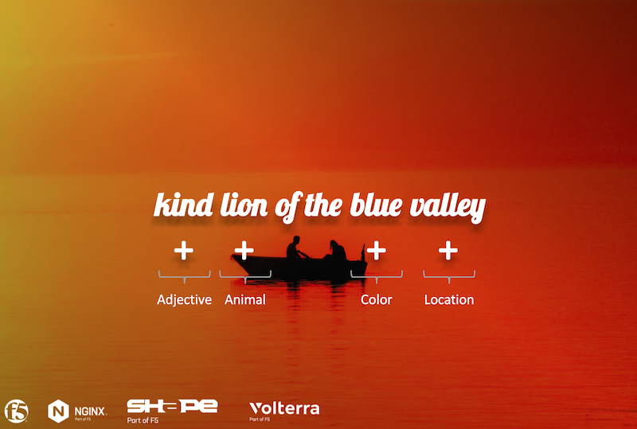

Lab 1 - The Sentence Application
################################

The application used in the lab
*******************************

For this lab, we will use this application : http://sentence.emea.f5se.com

This application is a modern application rendering a sentence with 4 words. Each word comes from a word generator micro-service.

|

You can learn more on this app here : https://github.com/MattDierick/sentence-generator-app

You can deploy the app in your own environment : https://gitlab.com/sentence-app

|

How application works
*********************

There are several microservices used by this app:

* **Frontend** : nginx webserver to render the webpage with the sentence
* **Background** : microservice rendering a background on the frontend webpage (usefull for EDGE2.0 use case)
  
* **Generator** : microservice querying the WORD microservices in order to get one word from each WORD microservice

* **Adjectives** : API Server microservice generating an "adjective" word
* **Animals** : API Server microservice generating an "animal" word
* **Colors** : API Server microservice generating a "color" word
* **Locations** : API Server microservice generating a "location" word

The ``generator`` will generate such below outcome. Each word coming from a ``WORD`` microservice.

  .. code-block:: JSON

     {
      "adjectives": "proud",
      "animals": "lion",
      "colors": "blue",
      "locations": "park"
     }

The Frontend microservice will ``render`` the words in a sentence. 

|

Deploy UDF Blueprint
********************

Deploy UDF blueprint ``Volterra Specialist Workshop`` right now : https://udf.f5.com/b/e2d27ca8-e80e-4d44-844f-6c7ea1f41df5

