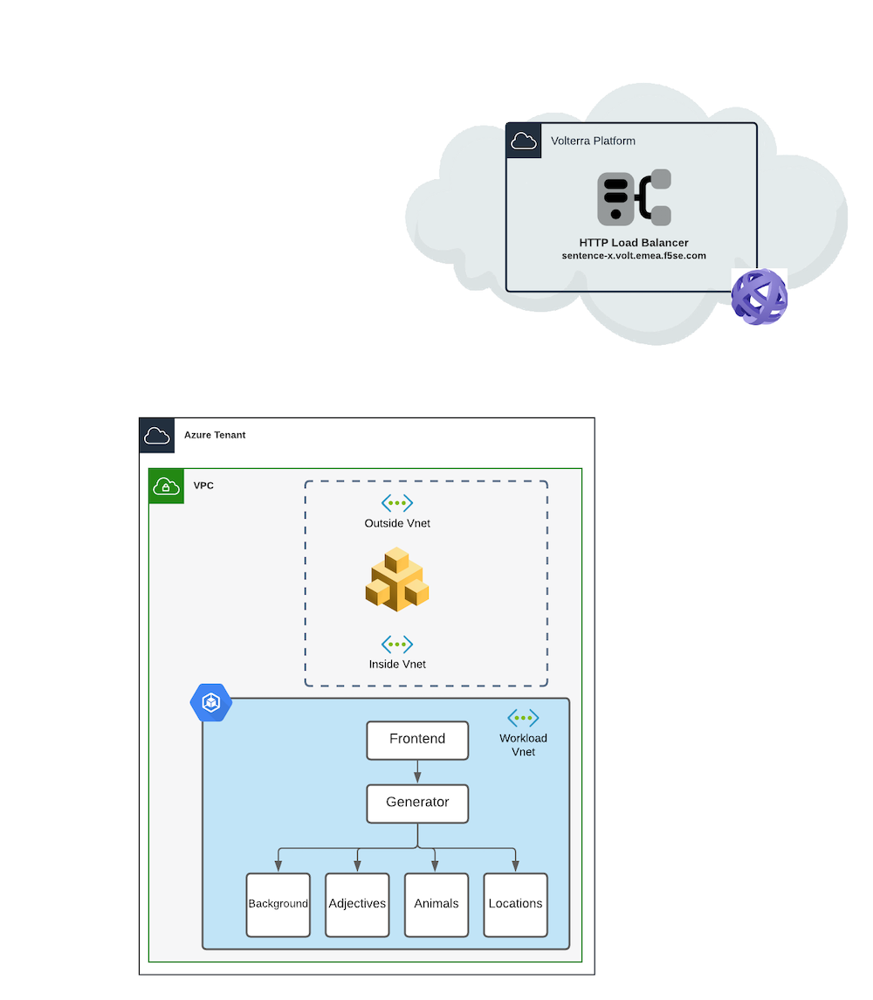
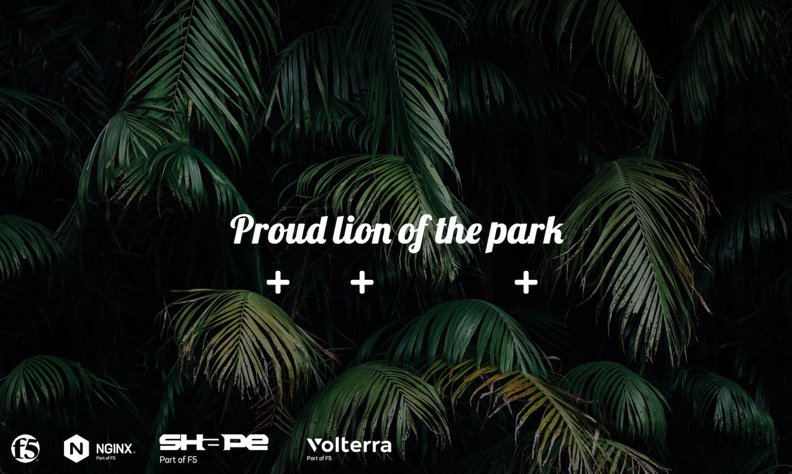

Lab 2 - Deploy the app in Azure AKS and expose it on Volterra Global Network
############################################################################

Deploy an AKS in Azure
**********************

.. note:: Check your AZ CLI is up and running in the right Tenant (F5 Sales) and Subscription (f5-AZR_4261_SALES_EMEA_SE - 1005fe30-e19e-4091-8480-8b61ecb8106e).
  
  * az account list

  .. code-block:: JSON
    :emphasize-lines: 4, 5
    
    {
    "cloudName": "AzureCloud",
    "homeTenantId": "e569f29e-b098-4cea-b6f0-48fa8532d64a",
    "id": "1005fe30-e19e-4091-8480-8b61ecb8106e",
    "isDefault": true,
    "managedByTenants": [
      {
        "tenantId": "dd3dfd2f-6a3b-40d1-9be0-bf8327d81c50"
      }
    ],
    "name": "f5-AZR_4261_SALES_EMEA_SE",
    "state": "Enabled",
    "tenantId": "e569f29e-b098-4cea-b6f0-48fa8532d64a",
    "user": {
      "name": "M.Dierick@F5.com",
      "type": "user"
    }

* If needed, you can switch to the EMEA-SE subs : az account set --subscription "f5-AZR_4261_SALES_EMEA_SE"

* Clone this Git to your laptop (dev branch) : https://github.com/f5devcentral/volterra-workshop-10x
* In the ``dev`` branch, enter to the folder ``labs-content/class3/terraform``
* Modify ``variables.tf`` according your project.

  .. warning:: Volterra does not support objects > 64 characters. So, use short name in your prefix and cluster name. 10 characters max per variable.

  .. code-block:: JSON

    variable "resource_prefix" {
    default = "Matt"
    }

    variable "cluster_name" {
    default     = "akscluster"
    description = "K8S Cluster for Matt"
    }

    variable "location" {
    default     = "westeurope"
    description = "The Azure Region in which all resources in this example should be provisioned"
    }

    variable "vm_size" {
    default     = "Standard_B2ms"
    description = "2 vpus, 8 GiB memory"
    }

* Deploy your Terraform plan

  .. code-block:: Terminal

    terraform init
    terraform plan
    terraform apply

  .. note:: Do not close your terminal, because the outcomes will be used in the next step to download your kubeconfig

* Get your kubeconfig file from yoru Azure AKS : 

  .. code-block:: Terminal

    az aks get-credentials --resource-group <YOUR-RG> --name <YOUR_CLUSTER_NAME> --file kubeconfig-myname

Publish the App without Colors microservice
*******************************************

* Use your favorite k8s client (kubectl, Lens ...) and connect to your cluster
* Deploy the 2 manifests to publish the sentence app on your AKS
  
  * Deploy labs-content/class3/k8s-deployments/aks-sentence-deployment.yaml
  * Deploy labs-content/class3/k8s-deployments/aks-sentence-deployment-nginx.yaml

.. note:: Wait few seconds, and try to connect to the Azure LB created by the manifest

|

Expose the app with F5 Distributed Cloud
****************************************

* DELETE the ``labs-content/class3/k8s-deployments/aks-sentence-deployment-nginx.yaml`` manifest so that we can now push the same ``without`` a LB
* PUSH the ``labs-content/class3/k8s-deployments/aks-sentence-deployment-nginx-private.yaml`` manifest

.. note :: Check the LB service is deleted. If not, delete it manually.

.. note:: Now, Sentence app is not published externally. A voltNode is required to access the app.

Deploy a new Azure Vnet Site
============================

* First, in Azure Portal, create a new ``Subnet`` in your Vnet. The Terraform only created one Subnet (10.240.0.0/16). This subnet is our private subnet.
  
  * Create a new ``subnet`` in the same Vnet (10.241.0.0/16). Name it ``aks-subnet-public``.

* Deploy a Azure VNET Volterra Node (Dual NIC) and assign the existing private and public subnets from your AKS Vnet.

  .. note:: The resource group must be a new resourve group. You can't use an existing one.

  .. image:: ../pictures/lab2/azure-site.png
     :align: center  

  .. image:: ../pictures/lab2/subnet.png
     :align: center

  * For the Cloud Credentials, select ``azure-emea-se``
  * Paste your public SSH key in case you need to connect to it for troubleshooting

* ``Apply`` the Azure Vnet Site

* WAIT and ``upgrade`` the node from the VotlConsole if required.

|

Discover the services
=====================

* Create a service discovery

  * Select your site, select ``site local inside network`` and upload your kubeconfig file
  * In ``VIP Publishing Configuration settings``, Don't forget to ``publish fully qualified domain to VIP mapping``

  .. warning:: There is a known bug here, this can take up to 15 minutes to display the services.

  .. image:: ../pictures/lab2/sd.png
     :align: center

* You should see all services + nginx as a nodeport

  .. image:: ../pictures/lab2/sd-ok.png
     :align: center

|

Create an Global Load Balancer and expose Sentence App
======================================================

* Create an Origin Pool with Nginx Frontend webserver as a member

  * Select k8s service type
  * Enter service name (copy paste from service discovery)
  * Select Inside network
  * Port 80 (port of the service in K8S)

  .. note:: Team discussion : How does Volterra manage to find the right back-end pool member (analogy to BIG-IP) ??? Check the LB and origin pool status.

* Create an LB to expose the Nginx Frontend webserver

  * Domain : sentence-<myname>.emea-ent.f5demos.com
  * HTTPS auto-cert
  * Select your Origin Pool

.. note :: Test your deployment

