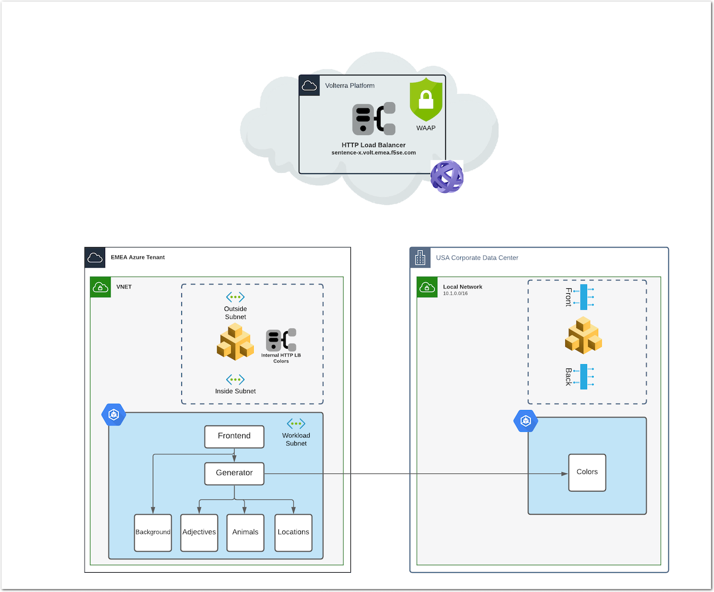
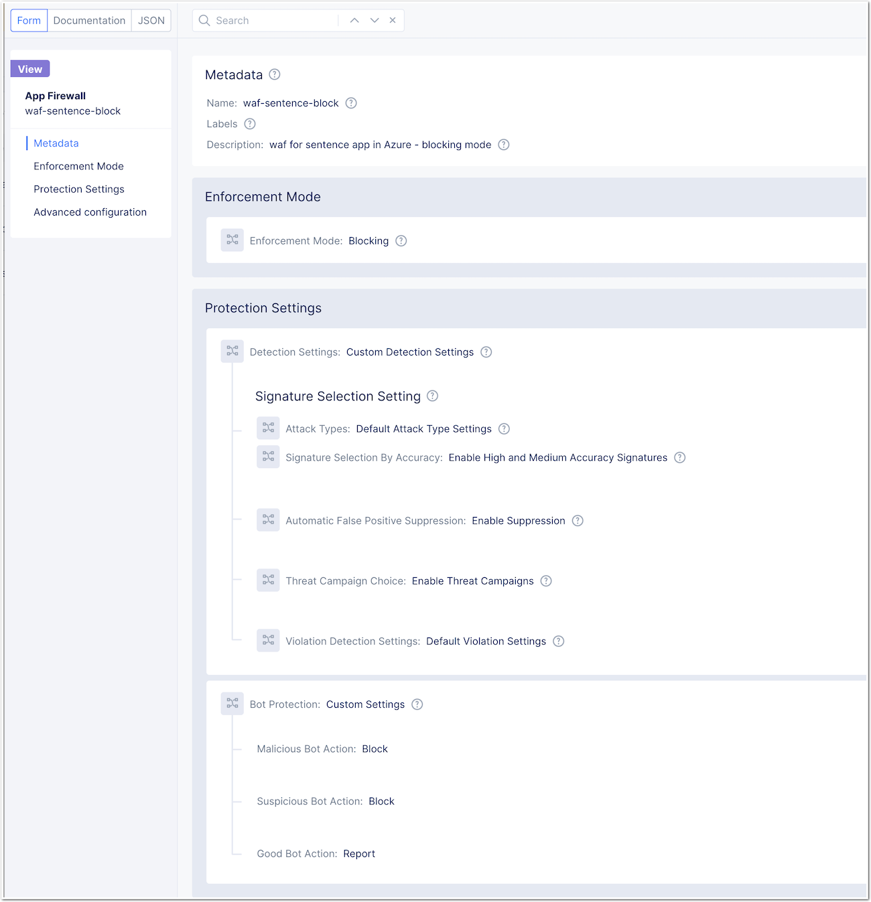

Lab 4 - Add WAAP protection
###########################

|

Create a WAAP policy
********************

* In App Firewall menu, create a new App Firewall objects
* Configure it as you want :) This is not new for you, so enable the settings your want (default or custom), but keep the policy in ``Blocking mode``

Assign the WAAP policy to your Distributed Load Balancer
********************************************************

* Assign this new WAAP policy onto your Distributed Load Balancer
 
  .. image:: ../pictures/lab4/waf-lb.png
     :align: center

* Test your App by sending Attacks and Bot requests

.. note:: Attack example. Add this string in the URI ?a=

.. note:: Bot example. Use curl ``curl --user-agent "Download Ninja2" http://sentence.volt-staging.emea.f5se.com``

* Check your Security Monitoring dashboard

  .. image:: ../pictures/lab4/security-event.png
     :align: center